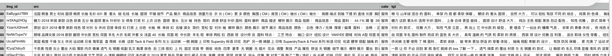
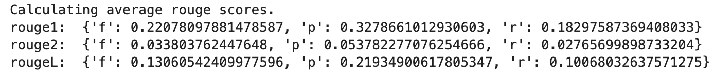
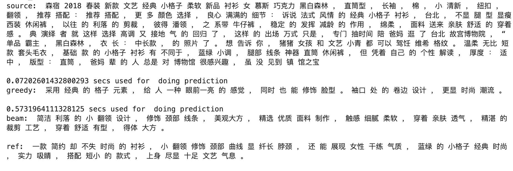
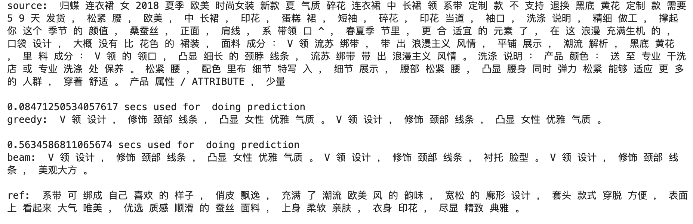
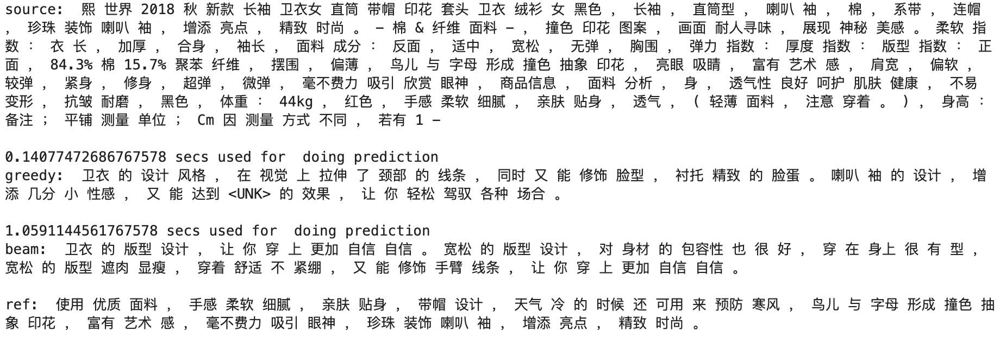
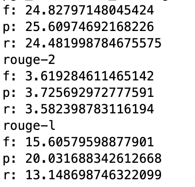

# 智能营销文本生成

#### 本项目主要采用抽取式和生成式文本生成两种技术，生成式摘要利用seq-to-seq+Attention模型作为baseline，然后构建一个结合生成式和抽取式的Pointer-Generator Network 模型。

##数据集


+ img_id: 图片id (可找到对应图片信息)
+ src: 原文本
+ cate：类别
+ tgt：营销文本

## Baseline 模型结构
传统的seq-to-seq结构，encoder为单层双向lstm，decode为单层单向lstm，encoder与decode存在注意力机制。

####模型评价结果



####模型预测结果



## Baseline + PGN 结果

#### 模型评价结果
```
rouge1:  {'f': 0.22579180774012303, 'p': 0.3358110155813078, 'r': 0.18773573825304915}
rouge2:  {'f': 0.04069564721274548, 'p': 0.0659177088513012, 'r': 0.03303021354041516}
rougeL:  {'f': 0.14572092920297028, 'p': 0.23803097221268668, 'r': 0.11327582732679974}
```

#### 模型预测结果



### 加PGN中加入coverage机制，减缓生成重复预料的问题，结果如下



同时rouge评分也有提高：

```
rouge1:  {'f': 0.24290397953479337, 'p': 0.30734503464012886, 'r': 0.22472345902295288}
rouge2:  {'f': 0.04246693516997104, 'p': 0.057581109132879726, 'r': 0.03835845520271739}
rougeL:  {'f': 0.1473398223763976, 'p': 0.209077200796943, 'r': 0.12340441059510353}
```

### 将数据中对应的图片信息，利用resnet34进行特征提取，用作encoder的初始化向量，得到的结果如下：

