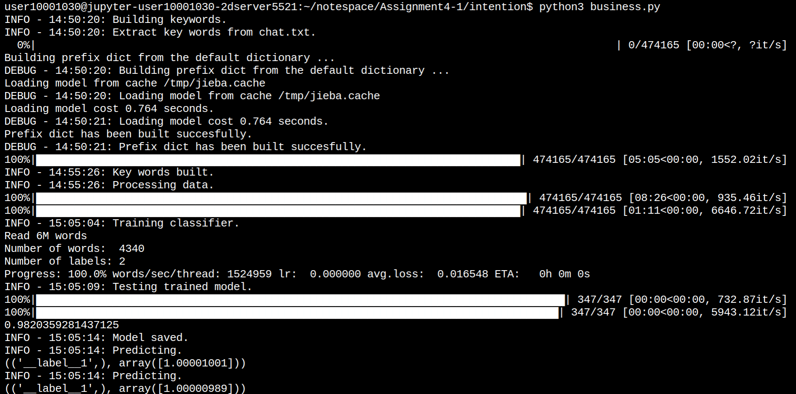
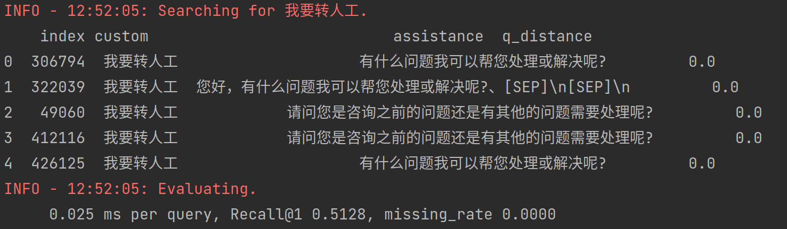
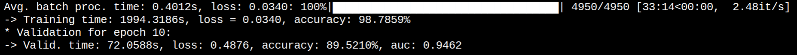
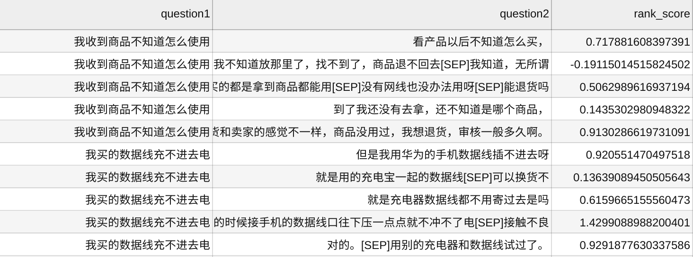

# Task 1: 意图识别

分类任务，判断对话是否在业务范围内。

若对话中存在关键词，则该对话属于业务范围内。ware.txt 与训练集 chat.txt 中的名词被定义为关键词。该规则用于构造本次项目的数据集，考虑到项目体验等，以下处理（utils/preprocessor.py)

由于绝大部分的关键词由 2-3 个中文字符组成，因此使用fasttext训练模型，理论上只需要将组成关键词的n-gram字符对应参数权重设置成足够大，那么可以达到训练、验证与测试集100%的准确率。

由于我们的模型只对用户发出的消息进行意图识别判断，因此训练集与测试集中，客服发出的消息将会被过滤掉。本次任务采用了10万组会话（约60万条用户消息）进行训练。(intention/business.py)

实验结果如何预期：

# Task 2: 检索与排序

本项目希望实现基于检索式的对话系统，对于用户输入的query，通过向量检索的方式，进行粗排。快速召回数据中可能匹配的候选问题集。

具体方法：构建HNSW图结构(/retrieval/hnsw_hnswlib)，利用word2vec生成图中点的特征表示，本次使用了10万组会话记录（约120万条消息）进行word2vec模型的训练。(/retrieval/word2vec)。

hnsw检索结果：query = '我要转人工'

将召回的结果进行排序，排序模型采用lightGBM进行打分，需要构建的特征包括TF-IDF、BM25、word2vec、FastText、深度匹配特征。(/ranking/)

其中深度匹配特征采用bert结构，对输入的两个问题做序列相似度的匹配，得到一个相似度的分数，预训练模型采用('bert-base-chinese'),模型效果如下

训练指标：准确率训练集 98.78%，验证集89.52%

最后将生成的人工特征整合到数据中，训练lightGBM分类器，将模型的打分结果对粗排的结果进行排序。

（ranked 结果截图）

# Task 3: 闲聊模块

当咨询判断为非业务时，使用闲聊模块进行回复

预训练模型 [权重](https://s3.amazonaws.com/models.huggingface.co/bert/bert-base-chinese-pytorch_model.bin) 与 [词典](https://s3.amazonaws.com/models.huggingface.co/bert/bert-base-chinese-vocab.txt)

利用bert预训练模型初始化参数，构建UniLM模型，实现闲聊文本生成。

#### 蒸馏

利用TextBrewer进行模型蒸馏

